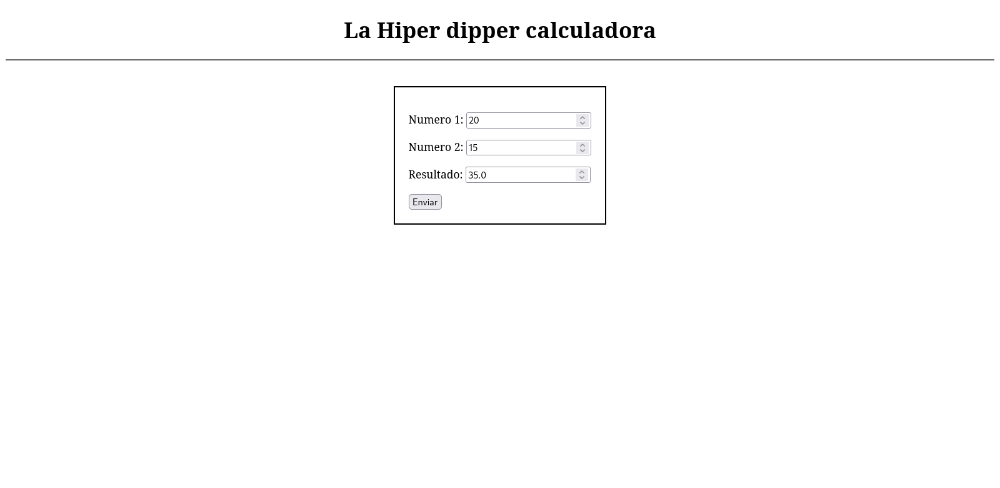

# Aplicacion 06 - Uso de formularios

Utilizando el módelo de diseño MVC se crea un programa el cuál haciendo uso de un formulario y del método POST simula el uso de una calculadora que solamente suma, donde se puede ingresar dos valores y devolver la suma de estos últimos

# Iniciar proyecto
Para iniciar el proyecto solo basta con escribir en la terminal:
```
python app.py
```

Luego visita http://0.0.0.0:8080/ en tu navegador preferido y deberías de ver algo como lo siguiente



# Estructura

* ## Views
  * calculadora.html: Uso de un formulario simple donde se pueden ingresar dos númers (numero_01, numero_02). Al enviar el formulario se realiza la suma de dichos números y la muestra en la parte correspondiente

* ## Models:
  * No se utilizó un módelo para este ejercicio

* ## Controllers:
  * calculadora.py: Controlador que se encarga de cargar la view calculadora además de utilizar el método POST para realizar la suma de los números ingresados

***
** *Realizado por Patricio :f* **